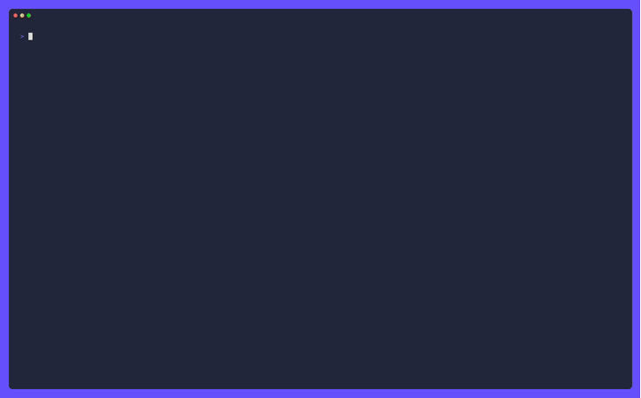

# Your coding agent should draw diagrams — so I wrote a Mermaid renderer for the terminal

Coding agents talk in text. That's fine for a diff, but it's a terrible medium for
architecture. When I ask an agent "how does auth flow through this service?", the
honest answer is a diagram — boxes, arrows, a fork where a request can go two ways.
A wall of prose is the wrong shape for that.

So I taught pi-go to draw Mermaid diagrams *in the terminal*, and the interesting
part turned out to be everything that isn't the diagram.

## Why not just render to an image?

The obvious move is to shell out to a headless browser, render the Mermaid to PNG,
and show it. That's what most tools do. It's also wrong for a TUI:

- It needs a browser and a network round-trip on every diagram.
- The result is a bitmap, which doesn't fit a text terminal's layout, doesn't
  reflow, and can't be selected or copied.
- It's slow. A diagram should appear as fast as the agent's next sentence.

The right output for a terminal is *text* — Unicode box-drawing characters, laid
out to the width of the pane. So I built a renderer that turns Mermaid syntax into
terminal art, adapted from the MIT-licensed `mmaid-go` engine and then pushed well
past where it started.

## The hard part is measuring text, not drawing boxes

Drawing a box is easy. Knowing how wide the box must be is not.

The original engine sized every box, centered every label, and placed every edge
caption with `len(s)` — the byte count. That is the display width only for ASCII.
The moment a label carries an emoji, it measures four columns per glyph and draws
two, so the box comes out too wide and the text sits off-center. CJK has the
opposite problem: it measures one column per glyph and draws two, so the text
overruns its border.

The fix is a small package that measures text in *terminal columns*, implementing a
deliberate subset of Unicode's UAX #11:

- combining marks and zero-width joiners take no space;
- East Asian Wide/Fullwidth characters and emoji take two columns;
- everything else takes one.

The subtle case is a variation selector. `U+FE0F` asks for emoji presentation,
which turns an otherwise narrow symbol into a two-column glyph. It carries no width
of its own, so measuring rune-by-rune misses it: `🛠️` is two columns and `🛠` is
one, and the only difference is a zero-width code point. The width function has to
resolve that before it can answer.

This is a *subset* of the full width table on purpose — enough to place a label
correctly, and small enough that the package depends on nothing outside the
standard library.

## The security work nobody sees

A diagram is untrusted input. The agent generates it, but the agent is fed by the
world, and a label can smuggle a terminal escape sequence. So the renderer:

- strips terminal escapes from labels before they ever reach the canvas;
- bounds the packet size so a pathological diagram can't balloon memory;
- recovers from panics in the parser and renderer, returning an error string
  instead of unwinding into the caller's view.

Nothing in the package writes to stdout or stderr, so it's safe to call from inside
the TUI's render path.

## The bug that rotted overnight

The golden tests caught something wonderful. One corpus case references `after b a`,
which the parser doesn't resolve, so that task falls back to `time.Now()` — and the
chart's axis label is *literally today's date*. The approved golden therefore
encoded the day it was generated and failed on the next date change, blocking every
open PR until someone re-approved it. Re-approving only bought another day.

The fix routes the gantt clock through a package variable and freezes it in the
test's `TestMain`, so a golden is a function of its input alone. Production code
never assigns it. And the regenerated golden is a *better* approval than the one it
replaces: reading the real clock had stretched the axis from 2017 to 2026, which
squashed every task into a single cell. Against a frozen date, the same input
renders actual bars and puts the today-marker inside the range.

## Teaching the model when to draw

A renderer is only half the story. The other half is teaching the agent *when* to
emit Mermaid instead of an ASCII tree. The system prompt now distinguishes the two:

- **Mermaid** for flowcharts and processes — anything with arrows and decisions;
- **ASCII + emoji** for structure — package maps, folder trees, "what belongs to
  what".

The TUI paints diagram regions with a background rather than just an outline, gives
boxes, connectors, and groups distinct styles, and pads boxes tightly so they aren't
mostly empty. A diagram in a terminal should look like a diagram, not a wall of
`+----+` characters.

## What it adds up to

The renderer is ~1,500 lines across a parser, a graph model, a canvas, and a
text-width package. The interesting engineering was never the drawing — it was
measuring columns correctly, sanitizing untrusted labels, and making the tests
deterministic. That's the difference between a feature that works in a demo and one
that survives a year of real use.

If you're building a terminal tool that wants to show structure, steal the
text-width idea first. It's the piece everything else hangs off, and it's the one
everyone gets wrong.
